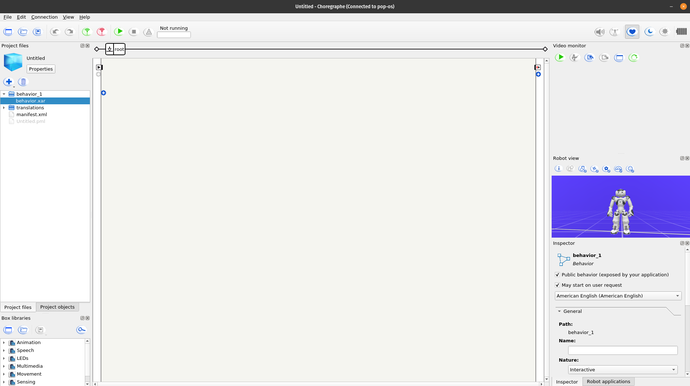
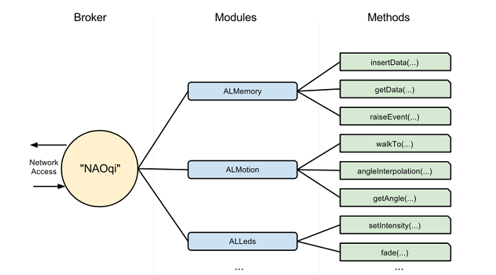
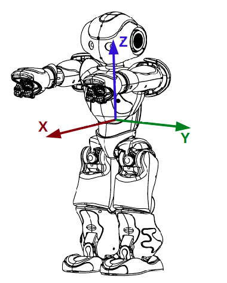

# Nao Documentation

This is a basic documentation that gives an easier introduction to using the Nao's python api.
All the steps below **should** work on any debian-based linux distributions, although it might be more reliable to use 
[ubuntu 14.04 32 bits](https://releases.ubuntu.com/14.04/).

## Choregraphe

First of all, and before getting to use the robot itself, one should try and use the simulator provided by the 
[Choregraphe software](https://www.softbankrobotics.com/emea/en/support/nao-6/downloads-softwares), its recommended to download
the binaries, extract it, use `chmod +x choregraphe` and finally execute it using the terminal.

## Changing the robot model
once running the program, you should see the above's screen, by pressing the edit tab, selecting preferences, and then virtual robot
the option to change the Robot model should appear, of which all the NAO versions should be compatible with the explanations provided further ahead

## Enabling the virtual robot

On the connection tab, select connect to virtual robot and you should be good to go.

From this point onwards, the explanations will be around the code present in this documentation, and on how to use the python API,
regardless of this, one could use the diagram boxes to build `behavior` files which will work as well, with a lot of bootstrapped
functions. It's worth noticing that the [Official documentation](http://doc.aldebaran.com/2-1/naoqi/index.html) states that
writing code and using the available api's will always outperform any program built on choreograph.

## The API

This code base/tutorial/documentation its made based of the use of the python 2.7 provided by Softbank Robotics.
The sdk should be configurable as interpreter for the system, but given that it's only useful for this application, its 
recommended to run the python code directly from the bin folder python executable.

### How it works

The nao robot uses an OS which only runs code in *C++* and *Python*, but exposes modules that can be used in several other
programing languages to access the libraries and functionalities of the robot.

The broker it's the provider, the module the way of accessing internal functions, and the *Proxy*, which will be the one 
more interesting for this explanation, it's the object that represents the module in the memory of the external program.

You can see all the modules available with their respective functionalities [here](http://doc.aldebaran.com/2-1/naoqi/index.html), The rest of explanations will be on 
the classes on this repository.

## Basic and useful information

1. The full documentation has plenty of examples of basic uses, not very detailed oriented though.
2. The robot uses the SI units for measurements
3. The axis follow this image 

4. Every proxy uses the name of the module, the ip of the robot, and the port as parameters
5. To connect to the virtual robot, you can see the ip and port on Choregraphe by trying to connect to it with the green `connect to` button 